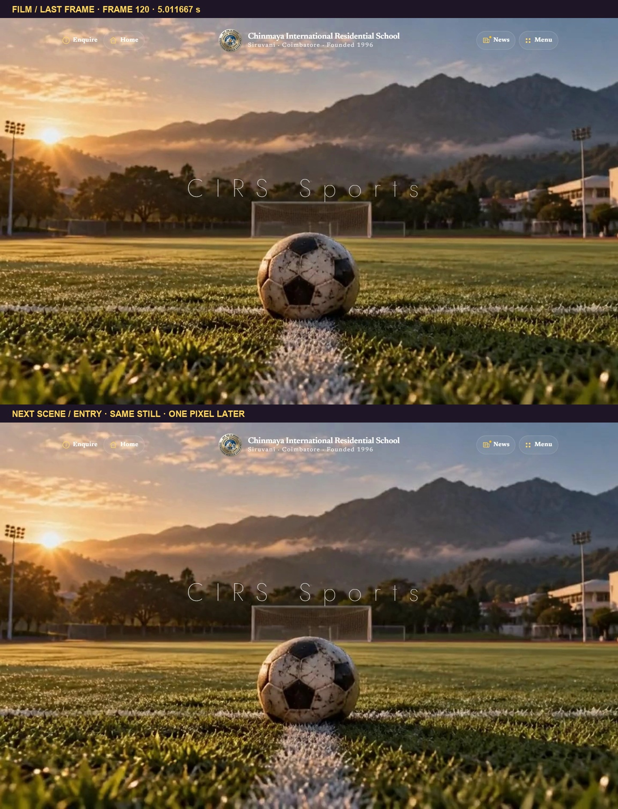
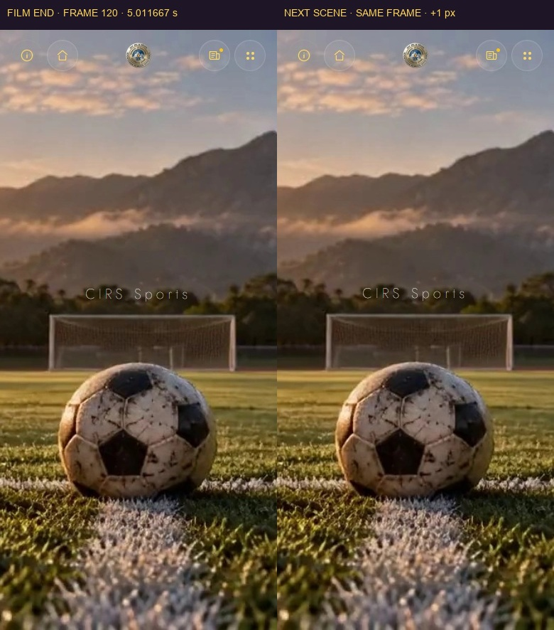
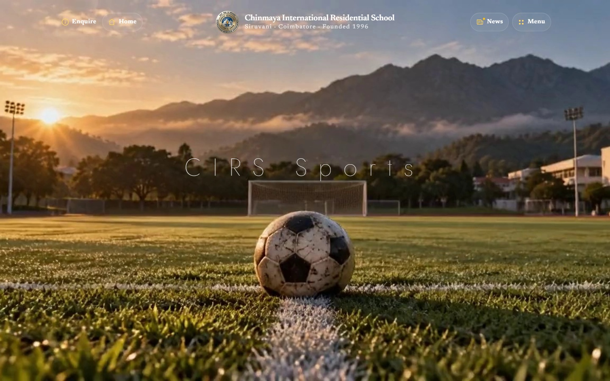
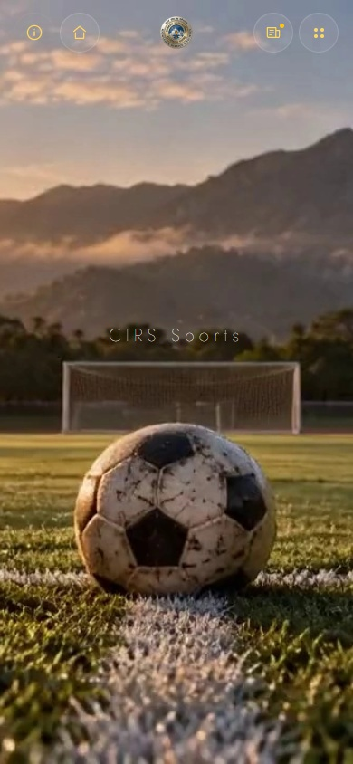
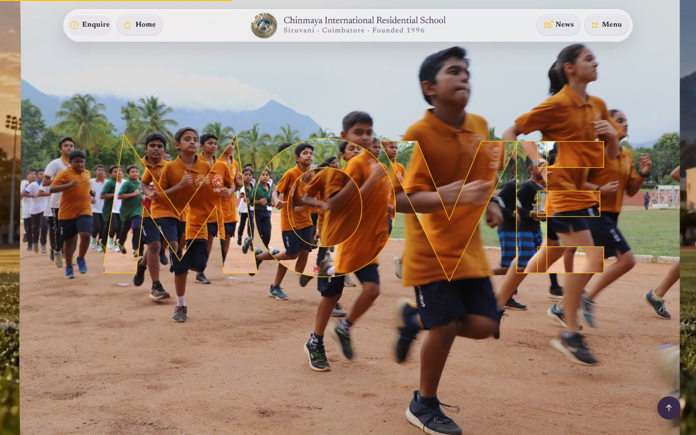
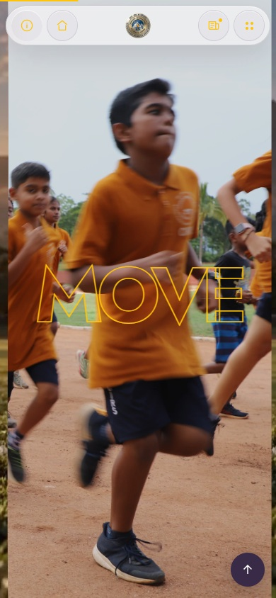
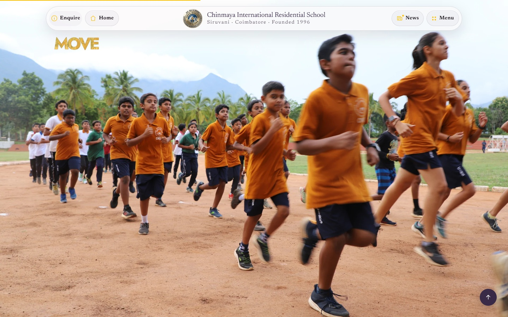
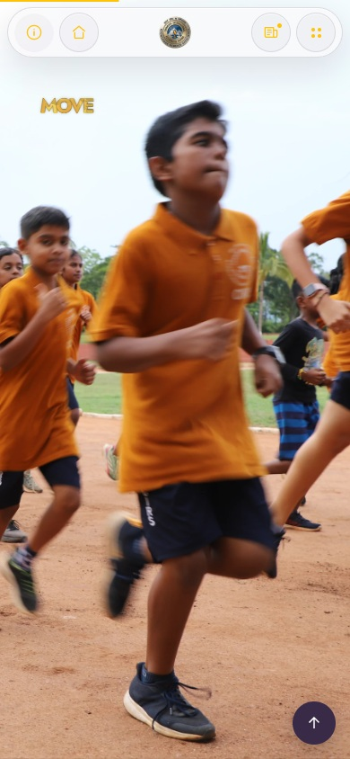

# Our Sports — browser review

The storyboard was saved before the page implementation in [`storyboard.md`](storyboard.md). Browser captures below were taken from the generated page in Chrome at 1440×900 and 390×844.

## Frame-to-frame handoff

The last video frame is frame 120 at 24 fps (`currentTime = 5.011667 s`). The next scene begins one CSS pixel later with the same extracted field frame and the CIRS Sports title at the same center point: (720, 396) on desktop and (195, 371) on mobile. The action photo then moves with the scroll and settles into the same crop used by the following track hold.

## The MOVE transition

The word enters over the runner photo, holds as photo-filled outlined type, then resolves into the full track scene. Each state was captured at the same scroll progress in both viewports.

### Entry

### Midpoint

### Exit

The midpoint was revisited after moving both forward and backward through the page. Scroll progress and the transition transforms matched at `0.50`; the JPEG captures differed by 1.04/255 on desktop and 1.13/255 on mobile. The stills are available as [`desktop forward`](browser-1440-midpoint-forward.jpg), [`desktop reverse`](browser-1440-midpoint-reverse.jpg), [`mobile forward`](browser-390-midpoint-forward.jpg) and [`mobile reverse`](browser-390-midpoint-reverse.jpg).

## Chapter reveals

The runner, court and pool scenes were reviewed at the beginning and mid-reveal of each chapter. Their incoming images are transparent during the reveal, so the preceding scene remains visible beneath them.

| Scene | 1440×900 | 390×844 |
| --- | --- | --- |
| Track | [Capture](browser-1440-chapter-track.jpg) | [Capture](browser-390-chapter-track.jpg) |
| Court | [Capture](browser-1440-chapter-court.jpg) | [Capture](browser-390-chapter-court.jpg) |
| Water | [Capture](browser-1440-chapter-water.jpg) | [Capture](browser-390-chapter-water.jpg) |

## Review notes

- Slow progress, a fast wheel jump and reverse travel all updated the same scroll-linked state. A 1700 px desktop wheel moved progress from 0.10 to 1.00, then an 800 px reverse wheel returned it to 0.60. At mobile width, 1100 px moved progress from 0.10 to 0.75, then 420 px backward returned it to 0.50.
- Keyboard activation of Court and touch activation of Water landed on the corresponding scene. The existing site’s 88 px anchor offset is included in the animated targets; reduced-motion and no-script targets use the three static scenes.
- Reduced-motion and JavaScript-disabled layouts remain in normal document flow. There is no horizontal overflow at either viewport and no browser console or page errors in the captures.
- The shared Captures opening still loads its six-second film and does not load the Sports page script.
- The local preview server supports HTTP byte ranges so the opening film can seek while scrubbing. This does not establish that the production host supports video ranges.

## Image provenance

The runner, court, pool and high-jump scenes are optimized crops from the supplied CIRS Drive photographs. See [`asset-sources.md`](asset-sources.md) for source mapping.
